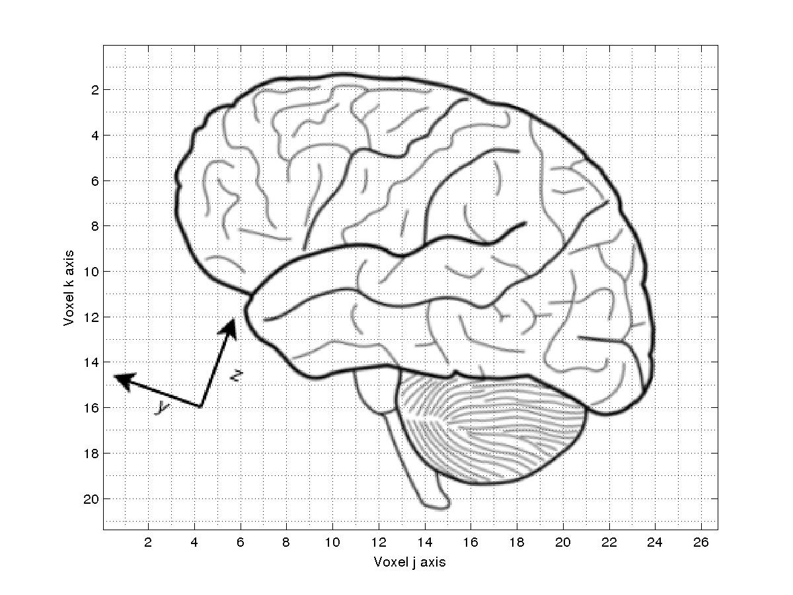
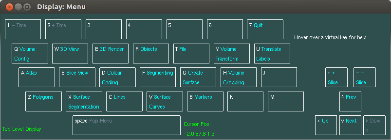
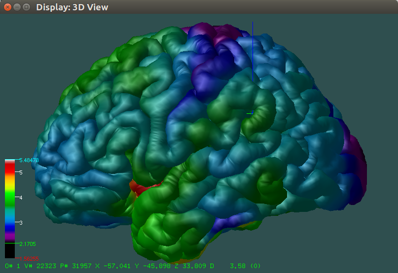

---
authors:
- 'Robert D. Vincent, Athena Buckthought, and David MacDonald'
title: |
    Display - Software for Visualization and Segmentation of
    Surfaces and Volumes
---

Introduction
============

is a program originally written by David MacDonald as part of this
thesis research while a student at the McConnell Brain Imaging Centre.
The program was designed to display and manipulate three dimensional
objects, mainly human cortical surfaces and sulcal curves. It has
evolved to include visualization and segmentation of 3D and 4D medical
images. The user interface is a non-standard menu oriented system based
on keystrokes and mouse (or touchpad) operations.

Visualization features
----------------------

supports a large number of visualization features.

-   Overlaying multiple volumetric images irrespective of differences in
    their sample grid sizes.

-   Visualization of 3D surfaces, and the intersection of the 3D surface
    with the volumetric data.

-   Displaying an arbitrary, oblique plane through the volumetric data.

-   Flexible choices for mapping from voxel data to colours.

-   Associating arbitrary per-vertex data with a surface.

-   Displaying intensity cross-sections along X, Y, Z, or time axes, or
    along arbitrary measurement lines.

Segmentation features
---------------------

allows a researcher to annotate structural features on either a surface
or a volumetric dataset.

-   Support for per-voxel labeling of volumetric data.

-   Arbitrary mapping from label values to colours.

-   Powerful fill, dilation, and erosion operations.

-   Multi-step undo of painting operations.

Coordinate system
-----------------

Most medical image files can be thought of as having two different, but
equally important coordinate systems. The first system is called
*voxel* coordinates in this document. By voxel coordinates
we mean the position of a particular voxel in the absolute reference
frame of the sampled data. Since medical images are generally sampled at
discrete points in time and space, voxel coordinates are naturally also
discrete, and numbered from zero to $N_i-1$ where $N_i$ is the number of
sample points along voxel dimension $i$.

In contrast, *world* coordinates refer to the actual
position of the patient with respect to the image. In this document, we
define that the world X-axis always increases from patient left to
patient right, the Y-axis increase from patient posterior to anterior,
and the Z-axis increases from patient inferior to superior.

Most medical image formats define a transformation from voxel
coordinates to world coordinates. always defines a current
*cursor* position within the space, and keeps of this
position with respect to both coordinate systems.

When displaying a single volume, will show the volume oriented in its
original voxel coordinate frame, attempting to orient the image such
that the voxel axis closest to the world X axis, for example, will be
used as the X axis in the image.

When displaying multiple volumes, will re-orient subsequently loaded
volumes so that their world coordinates are consistent with those of the
first loaded volume.

What’s new in Version 2.0
=========================

A number of major features have been added in 2.0. Many of the features
are cosmetic or user interface improvements, others involve core
functionality.

Core functions
--------------

-   The intersection between a 3D surface and the loaded volume is
    automatically displayed in the slice window.

-   Dynamic scans (e.g. DTI, fMRI, and PET) can now be loaded in .

-   The ability to read FreeSurfer (.mgz/.mgh) and NIfTI-1 (.nii)
    volumes.

-   Output support for surface formats including Wavefront OBJ, Stanford
    PLY, GIFTI, and X3D.

-   The ability to read and display GIFTI (.gii) or BrainSuite surfaces
    (.dfs) and BrainSuite tractography (.dft) files.

-   The previous 20 painting operations can be undone.

-   A user can now load per-vertex data, such as cortical thickness
    measurements, for visualization on 3D surfaces.

User interface
--------------

-   Users can now save and restore their preferred window positions and
    sizes.

-   Dynamic help text is displayed for each menu command.

-   Better integration with modern mice and trackpads.

-   Addition of new information in the 3D View and Slice View windows.

-   New mouse and key bindings to speed access to important commands.

-   User interaction can now use a graphical interface rather than the
    terminal window.

The new version also includes many bug fixes and performance
improvements.

Installing and Running 
=======================

runs on most POSIX-compliant operating systems, including Linux and Mac
OS X. You may find that is already installed on your workstation.

Installing 
-----------

If you do not already have installed, you can install it as part of Minc
Tools (version 1.0.01 is recommended), following the instructions at:
<http://www.bic.mni.mcgill.ca/ServicesSoftware/ServicesSoftwareMincToolKit>.

Alternatively, the source code for MNI-Display is available on Github:
<https://github.com/BIC-MNI/Display>.

Once you have installed the program, you must also source the
environment before you can run it. That is, if you installed it to
/opt/minc, then you must type in the terminal window:

      source /opt/minc/minc-toolkit-config.sh # (for bash)

or

      source /opt/minc/minc-toolkit-config.csh # (for tcsh)

Change these directories if it you installed the toolkit to a different
location. Then you should be ready to run the program.

More information about MNI-Display is also available at:
<http://www.bic.mni.mcgill.ca/software/Display/Display.html> and
<http://www.bic.mni.mcgill.ca/~david/>.

Running 
--------

To run , type the following in a terminal window:

        Display  [file1]  [file2]  ... [fileN]

where each file is one of:

-   A volumetric image, containing an MRI, PET, or other 3 or 4
    dimensional volume, with a filename extension .mnc,
    .nii, or .mgh.

-   A 3D object file containing 3D surfaces, lines, or other objects,
    and with the filename extension .obj.

-   A tag point file containing a list of 3D points, such as those
    chosen from a volume, with the filename extension .tag.

-   A colour map file that contains a list of label values followed by
    colour codes, with the file extension .map.

Note that the above files may be compressed. If the file ends in
.gz, then it is compressed and the full name of the file,
including the .gz, must be specified to .

Note that you can load more than one of either the volumetric images or
the 3D object files. If you do load multiple files of the same type,
they will be displayed in the appropriate window simultaneously. will
attempt to overlay the two images, as long as they are in approximately
the same location relative to the world coordinate space.

Command line options to are keywords introduced with a dash (’-’)
character, often with one or more additional arguments. Supported
options include:

-   -help : Print basic usage information and exit.

-   -version : Print program and library version
    information and exit.

-   -label $filename$ : Load volume labels from the given
    file in .mnc or .tag format.

-   -skiperror : Ignore errors encountered when loading
    files from the command line.

-   -ratio $V_1$,$V_2$ : Display the value of volume number
    $V_1$ divided by value of volume number $V_2$ as part of the slice
    window status. You must load at least two volumes for this option to
    have any effect.

-   -global $name$ $value$ : Set the configuration variable
    of the given name to the specified value. supports an extremely
    large number of configuration options, many of these are described
    in Section [secGlobals].

-   **Initial range options:** These options request to use
    different approaches to setting the initial range of the colour
    mapping used to convert voxel values into colours. They each set two
    values, $M_{min}$ and $M_{max}$, that define this range. Voxel
    values less than $M_{min}$ are assigned the “under” colour, and
    voxels greater than $M_{max}$ are assigned the “over” colour.

    -   -range $A_{min}$ $A_{max}$ : Set the initial range
        used to map volume data to colours to the
        *absolute* values specified. The value $A_{min}$
        should be less than $A_{max}$.

    -   -rel\_range $R_{min}$ $R_{max}$ : Set the initial
        range used to map volume data to colours to the
        *relative* values specified as a fraction of the
        total data range, $M_{min} = V_{min} + R_{min}
          (V_{max} - V_{min})$ where $(V_{min},V_{max})$ is the real
        range of the voxel data. For example, if $R_{min}=0.2$,
        $V_{min}=-1.0$, and $V_{max}=+1.0$, then $M_{min}=-0.6$.

    -   -hist\_range $P_{min}$ $P_{max}$ : Set the initial
        range used to map volume data to colours to the percentile
        values specified. For example, a $P_{min}$ value of 0.2 attempts
        to set $M_{min}$ such that 20% of all voxels will have values
        below the colour coding range.

-   **Volume colour coding options**:

    -   -gray : Use grayscale colour map for subsequently
        loaded volumes.

    -   -hot : Use hot colour map for subsequently loaded
        volumes.

    -   -spectral : Use spectral colour map for
        subsequently loaded volumes.

    -   -red : Use red colour map for subsequently loaded
        volumes.

    -   -blue : Use blue colour map for subsequently loaded
        volumes.

    -   -green : Use green colour map for subsequently
        loaded volumes.

The colour mapping options normally apply to the volumes specified after
the option, and these options can be repeated to set different values
for subsequently loaded volumes. For example:

    Display -gray -rel_range 0.1 0.9 t1.mnc -spectral -range 0 1000 rs.mnc

would load the first volume with the gray colour map and the colour
coding range set at 10% and 90% of the real voxel range. The second
volume would be loaded with the spectral colour map and absolute colour
coding range set to 0, 1000.

 Windows
========

When starts, it normally creates up to four different windows. Each
window has a specialized purpose.

-   The 3D view window displays the 3D objects, such as surfaces, lines,
    and markers. If no 3D objects are loaded, it may not be displayed.

-   The slice window displays up to 4 views of slices through one or
    more volumes. If no volumes are loaded, it may not be displayed.

-   The menu window shows the current menu command options.

-   The object window shows a list of the currently loaded 3D objects.

Menu Window
-----------

 [winMenu]

The menu window (Figure [winMenu]) contains the representation of the
partial keyboard, the name of the currently selected menu in the lower
left corner.

The current cursor position (in *world* coordinates) is
displayed in the lower central part of the menu window. The cursor
position will include the X, Y, Z, and time coordinates as appropriate.

As you move the mouse cursor over a key image displayed on the menu
window, a brief text message describing the function of that key will be
displayed in the upper right corner of the menu window.

Any right mouse click on a key image will invoke the function associated
with that key, if the key image is not “grayed out”. The function
associated with a key may either be a submenu or an actual command.

A middle mouse click in the menu window will return the menu back up a
level, similar to the operation of the space bar.

This window always has the title “Display: Menu”.

Object list window
------------------

[winObjList]

All 3D objects loaded and created in , with the exception of volumes,
are listed in the object hierarchy. The first entry in the object
hierarchy list, which initially consists of the text
’0:Polygons(0:0)’, refers to the built-in surface object
used when surfaces are created in .

The loaded objects are listed in the order they were listed on the
command line. Each loaded file is indicated by a list entry that
includes the file name followed by the file name in parentheses, and an
arrow. Loaded files are always treated as Model objects, which are
objects that can contain other objects, including polygons. You can
explore the items contained in the model by using the arrow keys to
navigate into the object hierarchy.

The arrow keys are used to move around in this hierarchy and to select
the current object. Also, clicking on an object in the 3D view window or
on the name of the object in the object list hierarchy with the left
mouse button will make it the current selection.

The 3D objects used by may be one of several types. They may be
*Markers* that record a single 3D position. They may be
*Polygons* that represent a complex surface using a series
of points or vertices to create a triangular mesh. They may be
*Lines* that represent a simple curve or shape, or a set of
curves such as diffusion tractography. Finally, *Model*
objects act as containers for any number of other objects, including
other models.

This window always has the title “Display: Objects”.

3D View Window
--------------

 [win3Dview]

The 3D View window shows three-dimensional objects such as surfaces and
lines, with lighting and camera control. A representation of the cursor
is also generally visible as a set of three coloured lines, where the
X-axis is red, the Y-axis is green, and the Z-axis is blue.

A user can also select per-vertex data, such as cortical thickness
measurements, which may be used to “colourize” the 3D image. If vertex
data is associated with an 3D object, a colour bar will be displayed on
the lower left side of the 3D view window when the cursor crosshairs are
over that object.

In the 3D window, the following mouse operations are available:

-   Left Button: Sets the current cursor position, and makes the object
    under the mouse the current object in the Object list window.

-   Middle Button: If the mouse is not near the cursor, rotates the 3D
    objects around the cursor. If the mouse is close to the cursor,
    translates the cursor along the axes.

-   Right button: translates the position of the 3D objects within the
    window.

-   Scroll: zooms the 3D objects.

-   Ctrl+Scroll: Changes the opacity of the selected object.

-   Shift+Left Button: While holding down the shift key,
    the left mouse button translates the position of the 3D objects
    within the window.

In addition, when per-vertex data is associated with an object and the
object’s colour bar is therefore displayed, the following mouse commands
apply when the mouse cursor is in the colour bar:

-   Left Button: If near the upper or lower limits of the colour bar,
    clicking the left button will allow you to drag the limit and change
    the current upper or lower limits of the colour coding.

-   Middle Button: Allows you to drag both limits simultaneously,
    maintaining a constant difference between them.

-   Shift+Left Button: Performs three different functions depending on
    exactly where the button is clicked:

    -   In the area above the upper limit, this will display a dialog
        that allows you to set the “over” colour for the object’s colour
        coding.

    -   In the area below the lower limit, this will display a dialog
        that allows you to set the “under” colour for the object’s
        colour coding.

    -   In the area between the limits, this will display a dialog that
        allows you to set the colour coding method used for this object.

The 3D window also contains a “status line” that gives information about
the object relative to either the cursor or the mouse pointer. The
fields in this status line are enumerated in Table [tab3DFields].

If the mouse pointer is over a 3D object, the status line displays the
object number (relative to the list in the Object list window), the
vertex number, the polygon number, and the vertex coordinates closest to
the mouse pointer. If the mouse pointer is *not* over the
3D object, this information is displayed relative to the current cursor
position.

lp0.8 Label & Description\
O\# & The index (number) of the nearest object.\
V\# & The index of the nearest vertex.\
P\# & The index of the nearest polygonal face.\
X Y Z & The coordinates of the nearest vertex.\
D & The value of the per-vertex data for that vertex, if
loaded. The number in parentheses gives the data column that is
currently displayed.\

[tab3DFields]

If per-vertex surface data is also loaded, that value associated with
the current vertex will be displayed as well. If no value is associated
with the vertex, the value field will display as a series of eight dash
characters.

Slice Window
------------

![Slice window showing the three orthogonal planes. Normally, the upper
left quadrant will display the sagittal plane, the upper right will
display the coronal plane, and the lower left will display the
transverse plane. The lower right quadrant will either display the
intensity plot (Section [secIntensity]) or the optional oblique plane if
enabled (images/Section [secOblique]).](display-slice.png) [winSlice]

The slice window displays slices of the loaded volumes, with various
options for mapping the voxel intensities into colours. Normally the
three orthogonal planes of a volumetric image will be displayed: The
sagittal in the upper left, the coronal in the upper right, and the
transverse in the lower left. The lower right quadrant is generally used
to display either an intensity plot (Section [secIntensity]) or an
optional oblique slice through an arbitrary plane (Section
[secOblique]).

In each of the three orthogonal quadrants, the width and height of the
field-of-view is displayed in world units near the top of the quadrant,
and the current slice position in voxel coordinates is displayed near
the bottom of the quadrant.

The far left side of the window contains the colour bar that is used to
show and control the current mapping of voxel intensities to colours.

In the lower left corner there is also a numeric display that shows a
number of useful value about the voxel under the mouse pointer, as
detailed in Table [tabSliceFields].

lp0.8 Label & Description\
V\# & The index (number) of the current volume.\
Xv Yv Zv & The location of the mouse pointer in voxel
coordinates.\
Xw Yw Zw & The location of the mouse pointer in world
coordinates.\
Vx & The raw voxel intensity.\
Vl & The scaled voxel intensity.\
Lb & The voxel label value.\
n/m & The ratio between volume $n$ and volume $m$, if
enabled.\
Dc & The distance from the cursor to the mouse pointer in
world units. This field can also show the distance from a marker to the
mouse pointer, in which case the label will show the number of the
marker rather than the letter ’c’.\

[tabSliceFields]

For each loaded volume, the slice window automatically associates
another volume of the same size as the loaded volume, which is referred
to as the **label volume**. The label volume may be
explicitly loaded by the user, but if no such volume is loaded, an empty
label volume will be created. Each voxel of the label volume typically
is a small integer value (in the range 0-255), where a value of zero
means no label has been selected for this voxel. Each label value is
also associated with a colour. This colour mapping is initialized to a
set of internal values automatically, but you can load a specific colour
mapping using either the command line or menu system.

In other words, every loaded volume has one “voxel” colour map that is
used for translating the values of the original volumetric dataset into
a set of colours, and there is a second “label” colour map used to
translate each user-assigned label value into a colour.

The slice window will also display a “trace” of any registered surface
that is displayed in the 3D View window. These traces represent the
intersection between the surface and the plane in the current slice
view(s).

In the slice window, the following mouse operations are available:

-   Left Button: Sets the current cursor position.

-   Middle Button: Moving the mouse up or down while holding down the
    middle button changes the current volume slice position.

-   Right Button: Paints a region of the current volume slice with the
    current brush label and size.

-   Shift-Left Button: While holding down the shift key,
    the left mouse button translates the position of the slice within
    the viewport.

-   Shift-Middle Button: While holding down the shift key,
    holding down the middle button and moving the mouse pointer up or
    down changes the magnification of the current slice.

-   Shift-Right Button: While holding down the shift key,
    holding down the right button erases regions of the labels.

-   Scroll: The scroll wheel changes the zoom level of the current
    slice.

-   Ctrl+Scroll: Changes the opacity of the selected volume.

-   Ctrl+Left Button: Starts displaying a line measuring the distance
    between the start and end of the mouse movement. There can be up to
    three of these line displayed at a given time. The intensity plot
    will display the intensity along the most recently drawn line (the
    colour of the plot will reflect this).

In addition, the following mouse commands apply when the mouse cursor is
in the colour bar:

-   Left Button: If near the upper or lower limits of the colour bar,
    clicking the left button will allow you to drag the limit and change
    the current upper or lower limits of the colour coding.

-   Middle Button: Allows you to drag both limits simultaneously,
    maintaining a constant difference between them.

-   Shift+Left Button: Performs three different functions depending on
    exactly where the button is clicked:

    -   In the area above the upper limit, this will display a dialog
        that allows you to set the “over” colour for the volume’s colour
        coding.

    -   In the area below the lower limit, this will display a dialog
        that allows you to set the “under” colour for the volume’s
        colour coding.

    -   In the area between the limits, this will display a dialog that
        allows you to set the colour coding method used for this volume.

The relative sizes of the four slice views can be adjusted by clicking
and dragging with the right button down while the mouse cursor is close
to the intersection of the dividing lines between the slices.

Menu and Interaction System
===========================

The menu window (Figure [winMenu]) represents the layout of the left
side of the keyboard. A menu entry is selected by hitting the
corresponding key in any of the 4 windows, or by pointing to the entry
in the menu window with the mouse and clicking the left button. The
space bar will pop back one level in the menu (as will the middle mouse
button, when the mouse is over the menu window). If the display of a
menu entry is “grayed out” (in a low-contrast colour), then this signals
that the command is not valid in the current context and cannot be
selected.

In the remainder of this document the following convention will be used
to refer to menu selection: / means select the 3D
View menu, then select the Reset View button from
within the 3D View menu.

Whenever text must be typed, such as in prompts for filenames, size and
width parameters, etc., will attempt to display a subwindow or “dialog
box” that prompts for the information requested. Each of these dialog
boxes contains an OK and Cancel button -
selecting the Cancel button should always stop the
requested operation without changing anything.

Some menu items cannot be selected by the mouse because the mouse must
be used to point to the object of the action, usually one of the 4
volume slices in the slice window. In these cases, the mouse must be
positioned over the relevant slice in the slice window and the keyboard
character corresponding to the menu entry pressed.

Whenever the user is prompted to type in a colour, either the name of a
colour, such as red, yellow, or
pink, or a numerical list of red-green-blue values, such as
(or for a semitransparent colour) may be entered. A complete listing of
colour names support by is given in Appendix [app:colours].

Keyboard Shortcuts
------------------

now supports a number of keyboard shortcuts for rapid access to certain
commands. Many of these are accessed by holding down the control
(’Ctrl’) key and typing another key.

-   Ctrl+B - Toggle between the primary and the secondary brush.

-   Ctrl+O - Open a file (/).

-   Ctrl+S - Save a file (/).

-   Ctrl+V - Select the next column in multicolumn vertex data.

-   Ctrl+Z - Undo the previous painting command (/).

-   \> - Move to the next time position ().

-   \< - Move to the previous time position ().

-   F10 - Toggle display of rulers in the slice view
    window.

-   F12 - Toggle autorotation of the 3D objects.

Complete Menu Reference
=======================

The following is a complete listing of every menu selection, with a
short description of each function. Since this program is also partly a
research tool, a few selections are not relevant to most users, and will
simply be described as not for general use. Figure [winMenu] shows the
top level menu that is presented upon program start up, or after popping
the menu to the top level.

Current Object
--------------

The 3D graphics objects, as displayed in the 3D window, are also
presented in a hierarchical form in the object list window, as a tree
structure with each element of the tree being the name of a 3D graphics
object. There are 4 keys that can be used to navigate through the list,
where the currently selected object is always displayed with a
surrounding box:

:   Sets the current object to the one before the current object.

:   Sets the current object to the one after the current object.

:   Sets the current object to the one above the current object (up one
    level in the tree).

:   Sets the current object to the one below the current object, if the
    current object is a model.

File
----

The file menu groups a number of commands relating to loading and saving
file data of various types.

/
:   Prompts for a filename and loads the file as the label volume for
    the current volume. The label volume need not have the same sampling
    or extent as the volume on top of which it is being loaded. This
    does not clear the current labels, unless the label file is exactly
    the same size and sampling as the underlying volume.

/
:   Prompts for a filename and saves the label volume of the current
    volume. The labels are cropped to the smallest size possible.

/
:   Prompts for a filename and loads the tags file into the current
    label volume. Note that it does not clear the current label volume,
    so the resulting labels are the union of the current labels and the
    loaded tags. Also, it does not check that this is a valid label
    file, e.g., whether sizes match.

/
:   Prompts for a filename and saves the current label volume as a tag
    file. For large regions this may create very large ASCII files, and
    it may be more efficient to save as .mnc.

/
:   Prompts for a filename and saves voxels with the current label to a
    tag file.

/
:   Prompts for a filename and loads the current user defined colour map
    as an ASCII file, with a default suffix of .ccd. It
    automatically switches the colour coding mode to user defined, in
    order to reflect the new map loaded from the file. Each line in file
    contains a position and a colour. The first position in the file
    must be 0, the last must be 1, and the intermediate ones must be
    monotonically increasing. The colours may be specified as 3 or 4
    space separated values in the range 0 to 1, or as one of the
    predefined colour names. For instance, the gray colour scale is
    equivalent to a file with two lines, the first being **0
    black**, the second being **1 white**.

/
:   Loads a file of per-vertex data, such as cortical thickness
    measurements, and associates it with the currently selected object.

/
:   Prompts for a filename and saves any markers at or under the current
    object to the file in tag file format.

/
:   If the mouse is pointing to one of the four slice viewports, prompts
    for a filename and saves the contents of the slice viewport to the
    file, in .rgb format. This will work for the intensity plot as well
    as the slice images.

/
:   Prompts for a filename and saves the current object, or all objects
    contained in the current object, if the current object is a model
    object. Files are typically saved in MNI .obj format, but single
    polygonal surfaces can also be saved in Stanford (.ply), X3D (.x3d),
    or Wavefront (.wf.obj) format. will select the format based on the
    extension of the filename you supply.

    This selection *cannot* be used to save a volume file.

/
:   Prompts for a filename and loads the file. If it is a volume file
    (ends in .mnc), then the slice window is opened, if not
    already opened.

/
:   Prompts for a filename and saves the contents of the slice window to
    the file, in .rgb format. Before doing this, make sure the window is
    up to date and not in the process of drawing.

/
:   Prompts for a filename and saves the image contents of the 3D window
    to the file, in .rgb format. Before doing this, make sure the window
    is up to date and not in the process of drawing.

/
:   If the currently selected object is a polygon, this command will
    load per-vertex data to associate with this polygon. It will set the
    colours of the vertices appropriately, using the full range of the
    data and the spectral colour map. The file is assumed to be a text
    file (extension .txt, .tsv, or
    .csv), with exactly the same number of lines as there
    are vertices in the polygon.

/
:   Not for general use.

/
:   Not for general use.

/
:   Not for general use.

/
:   Not for general use.

/
:   Prompts for a filename and saves the label colour map of the current
    volume as an ASCII file, with a default suffix of .map.
    The label colour map is defined by /.

/
:   Prompts for a filename and loads the current label colour map as an
    ASCII file, with a default suffix of .map.

Intensity Plot {#secIntensity}
--------------

can show a graph in the lower-right quadrant of the slice view window.
This graph depicts the intensity values along a line through the current
cursor position, parallel to one of the spatial axes. The intensity plot
may also show the timecourse of the current cursor position or an ROI if
the time axis is present. The menu contains commands used to manipulate
some of the options for displaying this data.

By default, the intensity plot is enabled and the horizontal axis is
selected automatically using the following algorithm:

1.  If the current volume has a time dimension, the intensity of the
    current cursor location is plotted through time.

2.  If a measurement line has just been drawn, the intensity plot is
    taken along that line.

3.  If the mouse is over the sagittal view, the intensity plot is taken
    along the Y (posterior-anterior) axis.

4.  If the mouse is over the coronal view, the intensity plot is taken
    through the Z (inferior-superior) axis.

5.  If the mouse is over the transverse view, the intensity plot is
    taken through the X (left-right) axis.

In each case, a letter ’X’, ’Y’, ’Z’, or ’T’ will be displayed on the
horizontal plot axis to indicate which of the axes is being used. If a
measurement line is plotted, the horizontal axis simply shows the length
in ’mm’ along the line.

As explained above, when a time-varying (e.g. fMRI, DWI, or PET) image
is loaded, the intensity plot will automatically be computed using the
time axis. Furthurmore, whenever the image is segmented, the labels will
be used to define regions of interest whose mean intensity will be
plotted over the timecourse of the ROI.

For example, if you load an fMRI image and wish to examine the
timecourse of an specific region of interest, first paint the ROI using
the segmenting features of . Then, move the cursor inside the ROI. The
intensity plot will change colour to reflect the colour of the ROI’s
label. The intensity values will be computed as the unweighted mean of
all voxels with the selected label, for each time point in the image.

In any case, the intensity plot will be automatically disabled whenever
the oblique image is enabled.

/
:   Toggles the intensity plot on or off. If for some reason you do
    *not* wish to see intensity plots, they can be disabled
    with this menu option.

/
:   If this option is **on**, the vertical axis of the
    intensity plot will be automatically scaled to the actual data range
    of the currently selected data. If this option is
    **off**, the vertical axis will be permanently set to
    the full range of the voxel intensities of this volume.

/
:   This option allows to you specify a preferred choice for the
    horizontal axis in the intensity plot. This command allows you to
    cycle through the choices Auto, X,
    Y, and Z. The time dimension,
    T, is also available for time-varying scans. The
    Auto mode uses the logic described above to set the
    horizontal axis based on the dimensions of the loaded volume and the
    position of the mouse cursor.

    If one of the specific axes is selected, that axis will be used as
    the horizontal axis in the intensity plot irrespective of the
    current location of the mouse cursor. However, if a measurement line
    is drawn, the intensity along that line will still be displayed on
    the intensity plot axis.

Quit
----

The Quit menu’s principle function is to allow users to explicitly
confirm their intention to quit . However, the menu includes a few
miscellaneous commands.

/
:   Select this if you are sure you want to exit . The program will
    close.

/
:   Select this if you do not want to quit . You can also just press the
    space bar to return to the previous menu.

/
:   This command is intended for development and debugging purposes. It
    prints some possibly useful information about the memory usage of .

/
:   This command allows you to inspect or set the value of any of the
    many global variables (configuration options) that are supported in
    . When you choose this command, it will prompt you to enter a
    string. The string can either be the name of a global variable, or a
    global variable name followed by an equals sign and a new value. In
    the former case, the command will print the current value of the
    global variable. In the latter case, the command will set the
    current value of the global variable.

    For a list of many of the useful global variables in , see Appendix
    [secGlobals].

/
:   This command will save the current locations and sizes of all four
    windows (Menu, Slice View, Object List, and 3D View). The saved
    information will be used to restore the window layout the next time
    is used. The information is saved in your home directory in a file
    named .mni-displayrc.

Slice View
----------

The slice view menu is primarily concerned with manipulating the
orientation and position of the three (or four) slice views. It also
allows you to select which of the volumes is the currently active
volume.

:   Moves the cursor to the next slice.

:   Moves the cursor to the previous slice.

:   Moves to the next time point in a dynamic scan.

:   Moves to the previous time point in a dynamic scan.

/
:   If more than one volume is loaded, then this button increases the
    current volume index. If the the last volume is currently selected,
    this will return to the index of the first volume. The current
    volume index is displayed in the lower left corner of the slice
    view, with the field title V\#. For many operations,
    including intensity plots and colour-coding selection, the current
    volume is used as the target volume.

/
:   If more than one volume is loaded, then this button decreases the
    current volume index. If this command is chosen when the first
    volume is selected, the current volume index will be set to the last
    volume loaded.

/
:   If the mouse is in the slice view window and is pointing to one of
    the 4 slices, then the view for that slice is reset and resized to
    fit the viewport.

/
:   If the mouse is in the slice window and is pointing to one of the 4
    slices, then the visibility of that slice for the current volume is
    toggled.

/
:   Prompts for 3 box filter widths and another specifier. If the
    specifier is the character “w”, then the filter widths are assumed
    to be in world coordinates, otherwise it is assumed to be voxel
    coordinates. The current volume is resampled using a box filter,
    creating new volume which is overlaid on the original volume.

/
:   Prompts for 3 size parameter and resamples the current volume to the
    given size, creating another volume. Creates a volume with a smaller
    number of voxels by box filtering. It is preferable to use
    /, which maintains the number of voxels.

/
:   Creates and displays a flat, colourized rendering of the slice
    pointed to by the mouse in the 3D window.

/
:   Creates and displays a 3D object surface reflecting the relative
    intensities of the voxels in the current slice.

/
:   Creates a histogram of values in the current volume, which is
    displayed in the slice view window near the colour coding bar. If
    the mouse is pointing to a slice in the slice view window, then the
    histogram of *only* that slice of the current volume is
    displayed.

/
:   Same as /, but only includes values which are in
    labeled (segmented) regions.

/
:   This menu selection toggles the visibility of the cross section
    plane in the 3D View window.

/
:   Each of the four slices can be oriented to an arbitrary angle. By
    pointing to one of the slices and selecting this menu option, the
    user can set the current arbitrary view, which is the one that the
    following slicing commands operate on.

/
:   Turns on or off the visibility of the cross-section plane in the
    three views which are not the current arbitrary view.

/
:   After selecting this entry, the middle mouse button in the 3D window
    will control rotation of the arbitrarily oriented slice, updating
    the current view slice in the slice window.

/
:   Instead of rotating the slice in the 3D window, the orientation of
    the current view slice can be chosen from within the slice window.
    After selecting this command, the left mouse button selects a
    position on one of the other slices. The line through the slice
    cursor and this position is used to define the slice plane of the
    current view slice.

/
:   Turns on and off the anchoring of the current view slice to pass
    through the cross section of the current slice view. This is used to
    constrain a slice plane to pass through a given vector.

/
:   Prints the cursor location in world space in the terminal window.

/
:   Prints the world space normal of the slice currently under the
    mouse.

/
:   Prompts the user to type in a world space x, y, and z, and moves the
    cursor to this point.

/
:   If the mouse is pointing to one of the four slices, prompts the user
    to type in a world space x, y, and z, and orients the slice plane to
    this normal.

/
:   Makes only one volume visible, cycling through all loaded volumes as
    the button is pressed. Whichever volume is made visible is set to
    the current volume.

/
:   Make all of the volumes visible again.

/
:   Prompts the user for an opacity value and sets the opacity of the
    current volume.

Volume Config
-------------

This menu includes several miscellaneous commands, as well as two sets
of options for controlling the filtering or smoothing of data in the
Slice View window.

The global interpolation command, /, changes the
interpolation method used for all volume accesses. As such, it will
change both the volume display and the specific values shown in the
Slice View status. This interpolation smooths across all of the
dimensions of the volume.

The per-view interpolation methods only affect individual views (the
sagittal, coronal, or transverse planes). This interpolation occurs only
between slices, perpendicular to the slice view plane. The filter width
setting controls how many slices will be included in the filtered
display.

/
:   Sets the filter type of the current volume slice under the mouse to
    nearest neighbour (this is the default).

/
:   Sets the filter type of the current volume slice under the mouse to
    linear interpolation between the two nearest slices.

/
:   Sets the per-view filter type of the volume slice under the mouse to
    a box filter. If the mouse is not over a slice view, this command
    has no effect.

/
:   Sets the per-view filter type of the volume slice under the mouse to
    a triangle filter. If the mouse is not over a slice view, this
    command has no effect.

/
:   Sets the per-view filter type of the volume slice under the mouse to
    a Gaussian filter. If the mouse is not over a slice view, this
    command has no effect.

/
:   Prompts the user for the full width half maximum for the per-view
    filter of the slice view under the mouse. Each view has its own
    filter width. This value applies only to box, triangle, or Gaussian
    filters. It does not apply to the nearest-neighbour or linear
    filters. If the mouse is not over a slice view, this command has no
    effect.

/
:   Toggles the global interpolation method used for rendering slice
    images for the entire volume. The choices are nearest neighbour (the
    default), trilinear, and tricubic. This setting will affect the
    values shown in the Slice View status display, as they will also be
    interpolated.

/
:   Brings up a submenu that allows the user to delete the current
    volume. This does *not* affect the file from which the
    volume was loaded, it merely removes the volume from memory.

/
:   Toggles whether or not segmenting labels are shared across volumes
    with identical sampling. If this option is Off, each
    loaded volume is associated with its own independent label volume.
    If this option is On, the default, a single label
    volume will be shared between all volumes with identical sampling
    grids. Sharing labels allows users can paint a single set of labels
    on several similar volumes, such as T1 and T2 volumes of the same
    patient.

/
:   Toggles the incremental update mode of the slice window. When it is
    on, the slice window incrementally updates the slice window. This
    may still be useful when the slice window takes a long time to
    update, such as with cached volumes or in trilinear interpolation
    mode.

Volume Cropping
---------------

This menu allows the user to specify a subregion of a volume and to
create new volumes that are cropped to this region.

/
:   Toggles the visibility of the volume crop box in the slice planes.
    Note that the position of the volume crop box is relative to the
    current volume, so changing the current volume will change the
    appearance of the crop box.

/
:   Resets the volume crop box to the entire volume of the current
    volume.

/
:   After pressing this selection, an edge, a corner, or the entire crop
    box in the slice window can be moved by pressing the left mouse
    button and dragging to the desired position.

/
:   Prompts the user to type in the name of the file which will be
    cropped according to the crop box.

/
:   Crops the current crop filename with the current crop box volume
    limits, and loads the cropped file.

/
:   Prompts for a filename and creates the cropped volume as this file,
    without loading it.

Colour Coding
-------------

When you initially load a volume file, it will be displayed with the
default HOT METAL (red-yellow) colour coding. Use this menu to switch to
other colour coding scales, or to set colour values for labeled voxels.

/
:   Selects the spectral colour coding method for the current volume.

/
:   Selects the gray scale colour coding method for the current volume.

/
:   Selects the hot metal colour coding method for the current volume.

/
:   Selects the red colour coding method for the current volume.

/
:   Selects the green colour coding method for the current volume.

/
:   Selects the blue colour coding method for the current volume.

/
:   Selects the colour coding method for the current volume, where the
    scale ranges from black through to the current over colour, which
    can be any valid colour.

/
:   Selects the colour coding method for the current volume, where the
    scale is defined by the user as any piecewise linear function. At
    present the only way to specify this function is through the
    / function.

/
:   Selects the rarely used contour colour coding method for the current
    volume.

/
:   Prompts the user to type in the lower and upper colour coding limits
    for the current volume. These may be the same, which results in a
    binary thresholded volume coloured by the under and over colour. The
    upper limit may be a smaller number then the lower limit, which
    results in an inverted colour map,

/
:   Prompts the user to type in the colour for values in the current
    volume below the low limit.

/
:   Prompts the user to type in the colour for values in the current
    volume above the high limit.

/
:   Prompts the user to type in the intensity of the coloured labels
    superimposed on the current volume slices. ($0 <= value <= 1$).

/
:   Toggles between showing or hiding the label volume superimposed on
    the current volume.

/
:   Prompts for a label value and a colour, and sets the displayed
    colour of this label for the current volume.

/
:   Prompts for the number of labels desired, and recreates the current
    label volume with this number. Depending on the number of labels,
    the volume may be a byte, short, or long valued volume. Note that
    this effectively clears the current label volume.

/
:   Changes the colours of the current object in the 3D window according
    to the current colour coding parameters of the loaded volumes.

Segmenting
----------

This menu contains all the controls for modifying the current label
volume, which is overlaid on the current volume. For each voxel in the
current volume, there is an associated integer value, which is stored in
the current label volume. Segmenting consists of painting regions of a
label volume to change the values from the default of 0. When the right
mouse button is pressed over a slice in the slice window, the current
paint label value is painted into the label volume of the most recently
loaded visible volume.

### Erasing

The default value of all labels is zero, which is considered to be the
“erased” value. The erased value can be changed through the menu
commands If the control key or shift key is
held down along with the right mouse button, erasing will be performed,
by storing the value 0 (or the current erase value, if it has been set
to something other than zero).

### Secondary brush

implements a secondary brush size which can be quickly selected as an
alternative to the primary brush size. This allows rapid switching from
fine-grained to coarse-grained painting. By default the secondary brush
is a sphere 3 units in diameter. The Ctrl+B key combination is used to
toggle between these brushes, and the menu commands to set the brush
size will set the size of the current brush.

/
:   Sets all labels of the current volume to the erased state. Provides
    a cancel/confirm submenu, but *cannot be undone*.

/
:   Sets the current label used for painting. If the mouse is positioned
    over a voxel that has a non-zero label when this menu command is
    selected, then the current paint value is copied from that voxel.
    Otherwise, the user is prompted to type in an integer label, between
    0 and one less than the total number of labels.

/
:   Sets the current label value used for erasing. If the mouse is
    positioned over a voxel that has a non-zero label when this menu
    item is selected, then the current erase value is copied from that
    voxel. Otherwise, the user is prompted to type in an integer label,
    between 0 and one less than the total number of labels.

/
:   Prompts for the in-slice brush radius (i.e. both the width and
    height) used in painting on the volume slices. Any voxel which
    intersects the brush is painted. A radius of zero therefore paints
    only voxel the mouse is in. This gives the finest control over
    painting.

/
:   Prompts for the brush depth, the radius in the direction
    perpendicular to the slice plane. This defaults to zero, for
    slice-by-slice painting. If this is non-zero, then a ellipsoidal
    brush is used, and updating the display is a little slower because
    all slice views are updated as painting is performed.

/
:   Reverses the last painting or erasing operation which, in many
    cases, may be used to reset the state of the labels to before the
    previous operation. Operations that affect many different slices,
    such as loading labels from a file, or a 3D operation such as 3D
    fill, cannot generally be undone.

/
:   Sets the label of the voxel underneath the mouse to the current
    paint label. Can be undone.

/
:   Sets the label of the voxel underneath the mouse to the current
    erase label. Can be undone.

/
:   Sets the label of the entire slice pointed to by the mouse to the
    current paint label. Can be undone.

/
:   Sets the label of the entire slice pointed to by the mouse to erase
    label. Can be undone.

/
:   Prompts for a minimum and maximum volume value, and uses these
    limits for subsequent segmentation operations. When painting with
    the right mouse button, only voxels whose values are within this
    range are affected. Operations such as dilation, erosion, and 2D and
    3D filling are also affected by the current threshold. By default,
    there is no segmenting threshold, which can be explicitly specified,
    if desired, by a maximum value which is less than the minimum value.

/
:   If the mouse is pointing to a voxel which is within the selected
    segmenting range and which has a label not equal to the current
    paint label, then all similarly labeled voxels on this slice
    connected to the starting voxel are assigned the current paint
    label, by a flood fill algorithm. Can be undone.

/
:   Same as /, except ignoring the threshold. If the mouse
    is pointing to a voxel has a label not equal to the current paint
    label, then all similarly labeled voxels on this slice connected to
    the starting voxel are assigned the current paint label, by a flood
    fill algorithm.

/
:   If the mouse is pointing to a voxel which is within the selected
    segmenting range and which has a nonzero label, then all similarly
    labeled voxels on this slice connected to the starting voxel are
    assigned the erase label value, by a flood fill algorithm.

/
:   Toggles between using 8 (or 26)-neighbour and 4 (or 6)-neighbour
    connectivity in 2D (3D) operations such as fill, dilate, and erode.

/
:   Prompts the user for a label range which corresponds to outside the
    labels of interest, and erodes regions of the current paint label
    which are neighbouring the typed-in label range. Typically the user
    will type in “0 -1” to specify all labels which are not equal to the
    current paint label. *Cannot be undone*.

/
:   Prompts the user for a label range which corresponds to outside the
    labels of interest, and dilates regions of the current paint label
    which are neighbouring the typed-in label range. Typically the user
    will type in “0 -1” to specify all labels which are not equal to the
    current paint label. *Cannot be undone*.

/
:   If the mouse is pointing to a slice in the slice window, then the
    labels of the neighbouring slice are copied to this slice. For
    transverse slices, the neighbour is the slice just superior to this
    one. For coronal slices, the neighbour is the slice just anterior to
    this one. For sagittal slices, the neighbour is the slice just to
    the right of this one. Can be undone.

/
:   If the mouse is pointing to a slice in the slice window, then the
    labels of the neighbouring slice are copied to this slice. For
    transverse slices, the neighbour is the slice just inferior to this
    one. For coronal slices, the neighbour is the slice just posterior
    to this one. For sagittal slices, the neighbour is the slice just to
    the left of this one. Can be undone.

/
:   If the mouse is pointing to a voxel which has a label which is not
    equal to the current paint label and is within the threshold, then
    all similarly labeled voxels in the entire volume which are
    connected to this one are assigned the current paint label. This may
    take a few seconds to a minute. *Cannot be undone*.

/
:   Calculates the total volume of all voxels which have the current
    paint label. This may take few seconds to complete.

/
:   Replaces a label, or a range of labels, with a new label value.
    Prompts for a source label or label range, a destination label
    value, and as a volume value minimum and maximum value. All voxels
    which have the source label value and are within the specified value
    range are changed to have the destination label. If the maximum
    value specified is less than or equal to the minimum value, then
    this range is ignored, and the operation simply changes all
    occurrences of the source label to the destination label.

/
:   Toggles between updating only the slice on which the mouse is
    painting or all slices, in order to provide a speed tradeoff. By
    default, fast update is on, which results in fast painting.

/
:   Toggles the mode where the slice cursor follows the mouse during
    painting. This results in slower update speeds, but all slice views
    show updated labels as painting progresses, which may be helpful for
    detail work.

/
:   Toggles the visibility of the crosshairs cursor in the slice view
    window.

/
:   Toggles freestyle painting, where the brush follows every movement
    of the mouse, and straight-line painting, in which straight line
    segments are drawn between successive right mouse clicks.

/
:   Toggles the state of the undo feature. Allows the undo logic to be
    enabled or disabled.

Translate Labels
----------------

This is a menu which may be used to translate position of the all labels
by integral voxel increments.

/
:   Moves all labels one voxel in the upward direction of the slice
    pointed to by the mouse.

/
:   Moves all labels one voxel in the downward direction of the slice
    pointed to by the mouse.

/
:   Moves all labels one voxel to the left direction of the slice
    pointed to by the mouse.

/
:   Moves all labels one voxel in the right direction of the slice
    pointed to by the mouse.

/
:   Prompts for 3 voxel offsets and moves all labels by this amount.

Create Surface
--------------

This menu is used to create surfaces from the current volume and/or
label volume. Surfaces created from this menu may subsequently have
their appearance smoothed by the use of / or
/. During all surface extractions, the surface is displayed
in the 3D window as it is being created, and all program operations are
still functional. Note that the currently set crop limits from the menu
are used to constrain the range of the surface extraction.

/
:   Prompts for a value, then starts extracting a polygonal isosurface
    from near the slice cursor, using a variation of the 3D contouring
    algorithm called marching cubes.

/
:   Prompts for two values, specifying a volume value range, then starts
    extracting a polygonal isosurface from near the slice cursor. This
    differs from /, in that voxels are classified as in or
    out and the isosurface points are exactly half way between an inside
    voxel and outside voxel. Typically, this is only useful for
    segmented volumes, otherwise the user should use /,
    which results in a smoother surface.

/
:   Prompts for two values, specifying a volume value range, then
    creates a voxelated surface. A voxelated surface is one composed
    entirely of rectangular faces of voxels, the boundaries between
    inside voxels and outside voxels, as defined by the value range
    specified.

/
:   Same as / except operates on the label volume. For
    instance, if the user has painted a region with label 1, then to
    create a 3D isosurface of this region, select this menu option, and
    type in “1 1” for the min and max values. Note that as the user
    paints and erases labels, the 3D surface will update to reflect the
    changes.

/
:   Same as / except it operates on the label volume. For
    instance, if the user has painted a region with label 1, then to
    create a 3D voxelated surface of this region, select this menu
    option, and type in “1 1” for the min and max values.

/
:   If a surface extraction is in progress, this button toggles the
    extraction process on and off. This allows suspension and resumption
    of surface extraction.

/
:   Cancels the current surface extraction, if any is in progress,
    deleting the extracting surface. You must either make a created
    surface permanent, or reset the extracted surface, before you can
    create another surface.

/
:   If a surface extraction is in progress, the currently extracted
    surface is made a permanent member of the 3D object hierarchy, and
    the extraction terminated. You must either make a created surface
    permanent, or reset the extracted surface, before you can create
    another surface.

/
:   Modifies the surface extraction so that any voxels with label values
    with the specified range, which the user types in, are not used for
    the surface extraction. Defaults to the range (0, -1), which
    indicates that no voxels are invalid.

Atlas
-----

This menu controls the display of the Talairach atlas overlaid on the
the slice views. The colour atlas book by Talairach and Tournoux has
been scanned into a digital format and can be overlaid on any volume for
reference and comparison purposes.

/
:   Toggles between displaying scanned images of the Talairach Atlas
    Book superimposed on the volume slices. The first time this is
    pressed there will be a delay of about 2 minutes while the data is
    read in.

/
:   Prompts for the opacity of the atlas. A value of 1 will not show the
    volume slice through the atlas, while values closer to 0 will show a
    more transparent atlas on top of the volume.

/
:   Sets the distance from the current sagittal slice that atlas pages
    must be within in order to be displayed.

/
:   Sets the distance from the current coronal slice that atlas pages
    must be within in order to be displayed.

/
:   Sets the distance from the current transverse slice that atlas pages
    must be within in order to be displayed.

/
:   Flips the sagittal atlas pages around the X axis.

/
:   Flips the coronal atlas pages around the Y axis.

/
:   Flips the transverse atlas pages around the Z axis.

/
:   Not for general use.

3D View
-------

This menu allows for the rapid setting of the orientation and
magnification of object in the 3D view window. It also has some
experimental features related to 3D rendering.

/
:   Selects a view of the front of the objects.

/
:   Selects a view of the back of the objects.

/
:   Selects a view of the left side of the objects.

/
:   Selects a view of the right side of the objects.

/
:   Selects a view of the top side of the objects.

/
:   Selects a view of the bottom side of the objects.

/
:   Selects a view of the left side of the objects, tilted forward.

/
:   Selects a view of the right side of the objects, tilted forward.

/
:   Resets the view to a top view.

/
:   Without changing the view direction, magnifies the objects to just
    fit inside the window. Useful when the user desires to see the full
    extent of all objects.

/
:   Toggles between a parallel and perspective view of the 3D objects.

/
:   Creates a movie of the 3D window. Prompts for a filename prefix, an
    axis index (0-2), and a number of frames. The objects are spun
    around the specified axis, saving a separate frame to file for each
    increment.

/
:   Not for general use.

/
:   Not for general use.

/
:   Not for general use.

/
:   Not for general use.

/
:   Not for general use.

Objects
-------

This menu operates on the objects in the 3D window, which also have
textual representations in the Menu window, in the form of the object
hierarchy, which consists of lines, polygons, markers, and collections
of these, called models. Generally, object operations apply
to the currently selected object which is the one which has a green
rectangle around its textual representation in the menu hierarchy.
Selection of the current object can be performed by using the arrow keys
to navigate the hierarchy, or by clicking on the desired object text in
the Menu window. A second click on a model object will descend a level
to the set of objects contained in the model. Another way to select the
current object is to click on its image in the 3D window.

/
:   Puts up a confirm/cancel submenu to allow the user to delete the
    current object. If the current object is a model, the model and all
    objects it contains are deleted.

/
:   Prompts for a new colour for the current object.

/
:   Prompts for an ambient coefficient (0–1), a diffuse coefficient
    (0–1), a specular coefficient (0–1), a specular exponent (0–100 or
    so), and an opacity (near 0 is transparent, 1 is fully opaque). The
    currently selected object is assigned these lighting parameters.

/
:   Turns the current object invisible.

/
:   Turns the current object visible.

/
:   Toggles the visibility of the current object.

/
:   Turns the current object invisible, and advances to the next object,
    making it visible.

/
:   Turns the current object invisible, and advances to the previous
    object, making it visible.

/
:   Creates a model at the current position in the hierarchy. This is
    useful for grouping objects into a single file.

/
:   Prompts for a name and assigns this to the currently selected model
    in the object hierarchy.

/
:   Cuts the currently selected object out of the object hierarchy and
    adds it to the cut buffer.

/
:   Copies the entire cut buffer to the current position in the object
    hierarchy, and clears the cut buffer.

/
:   Mirror images the current object around the $X = 0$ plane.

/
:   Causes the intersection of the current object with the volume to be
    displayed in the slice window, by assigning the current paint label
    to any voxel which is touching the object. Works for polygons,
    lines, and markers.

/
:   Not for general use.

3D Render
---------

This menu contains commands to changing the way 3D objects are displayed
in the 3D view window.

/
:   Prompts for a colour to set the background colour of the 3D window
    and slice window.

/
:   Toggles the display mode of the current model between a wireframe
    rendering and a solid, shaded rendering. The default is shaded.

/
:   Toggles the display mode of the current object between a flat or
    smooth shading. The default is smooth (Gouraud).

/
:   Toggles the lights on and off. If lights are off, all objects are
    coloured uniformly.

/
:   Not for general use.

/
:   Not for general use.

/
:   Not for general use.

/
:   Toggles the display of the text labels of the markers in the 3D
    window.

/
:   Toggles whether lines are drawn straight or curved. May not be
    supported on OpenGL.

Markers
-------

This menu contains commands for creating and manipulating markers.
Markers are graphical object that define a specific point in the volume.
Each marker can be associated with a number of pieces of metadata, such
as a label, a colour, a structure ID, and a patient ID.

/
:   If the mouse is in the slice window over a volume pixel, a marker is
    created at that location. Otherwise, it is created at the current
    cursor position.

/
:   If the current object is a marker, then changes the marker’s
    position in a manner similar to /.

/
:   Prompts the user to type in the default marker size in real world
    units, typically millimetres.

/
:   Prompts the user to type in the default marker label string.

/
:   Prompts the user to type in the default marker colour.

/
:   Prompts the user to type in the default structure id.

/
:   Prompts the user to type in the default patient id.

/
:   Prompts the user to type in the default marker type, of which only
    cube is supported.

/
:   Prompts the user to type in the new size of the current marker, if
    the current object is a marker.

/
:   Prompts the user to type in the new label of the current marker, if
    the current object is a marker.

/
:   Prompts the user to type in the new type of the current marker, if
    the current object is a marker.

/
:   Prompts the user to type in a structure id. If the current object is
    a marker, then it is assigned this structure id. If the current
    object is a model, then all markers underneath this object are
    assigned this structure id.

/
:   Prompts the user to type in a patient id. If the current object is a
    marker, then it is assigned this patient id. If the current object
    is a model, then all markers underneath this object are assigned
    this patient id.

/
:   If the current object is a marker, sets the 3D cursor and the volume
    position to the position of the marker.

/
:   Moves the 3D cursor to the origin, which should be 0, 0, 0 in
    Talairach space. This is useful for making slides with the cursor as
    a reference to AC-PC.

/
:   This is the same as the /, duplicated in this menu for
    convenience.

/
:   Attempts to group markers by relative proximity, generating a
    different colour and structure id for each group.

/
:   Prompts for and sets the distance threshold which determines if two
    markers are close enough to belong to the same group. Default is
    1.5.

/
:   Allows the user to draw a rectangle on the 3D view of the markers
    and change all the markers within the rectangle to the default
    settings. This is done by pressing and holding the left button,
    sweeping out a rectangle, and when the left button is let go, the
    defaults are copied to the markers.

/
:   Copies the default marker values to the current object, if it is a
    marker.

/
:   Copies the default marker values to all markers which have the same
    patient id and structure id as the current object, if it is a
    marker.

Polygons
--------

This menu contains commands for creating and manipulating polygonal
objects. These are used to define surfaces.

/
:   Computes and prints the surface area of the currently selected
    polygonal object.

/
:   Prompts for a line thickness value used in displaying the current
    polygons in wireframe mode. Default value is 1.

/
:   Same as / except that the resulting polygons consist of
    triangles and quadrilaterals defined by lines of longitude and
    latitude, and rather than specifying the number of items composing
    it, the user specifies the number of intervals around and up the
    ellipsoid.

/
:   Not for general use.

/
:   Not for general use. Creates a “bintree”, similar to a KD-tree, that
    can speed up certain operations on polygons.

/
:   Computes normals for the current polygon, for use in displaying a
    smooth lighted surface in the 3D window.

/
:   Not for general use.

/
:   Not for general use.

/
:   Prompts for 3 numbers for the centre, 3 numbers for the radii, and
    an integer for the number of triangles, and creates an triangulation
    of an ellipsoid. The resulting polygon is a subdivision of a
    tetrahedron, an octohedron, or dodecahedron, depending on the number
    of triangles specified, which will be rounded to an appropriate
    multiple of 4 times either 4, 8, or 20.

/
:   Causes individual polygons in the current polygons object to share
    common vertices, which results in the object appearing to be more
    smoothly shaded.

/
:   Causes individual polygons in the current polygons object not to
    share common vertices, which has the visual effect of causing the
    object to be flat shaded.

/
:   Not for general use.

/
:   A second way to compute normals for a polygon, which results in
    smoother shading. Prompts for a number of iterations and a ratio
    value between 0 and 1. The normals for the polygon are computed
    using the / algorithm, then the iterations are
    performed. Each iteration consists of smoothing each polygon vertex
    normal with its neighbour vertex normals, based on the ratio value.
    A value of 0 causes no change in each iteration, where a value of 1
    sets each vertex normal to the average of its neighbour vertex
    normals. Typically, use the values “5 1” for this selection.

Surface Curves
--------------

This menu is used to draw curves on surfaces, for the purposes of
delineating sulci and gyri, or for drawing regions on the surface which
can then be coloured.

/
:   Enters curve drawing mode. Any left mouse click on the surface in
    the 3D window will define a point on the surface. Subsequent points
    on the surface are connected by a line of shortest distance along
    the surface. The first mouse click will cause precomputation of
    neighbours in the polygons which may take several seconds.

/
:   Exits from curve drawing mode.

/
:   When in curve drawing mode closes the curve by connecting the end of
    the curve with the start of the curve.

/
:   Picks the closest point on a line to the point under the mouse, and
    adds it to the current surface curve.

/
:   Clears the current curve.

/
:   Copies the current curve permanently into the object hierarchy.

/
:   Prompts the user to type in a curvature weight. A value of -100 will
    tend to make surface curves follow sulci, and a value of 0 (default)
    makes it just choose shortest path along the surface. Generally,
    this parameter has not been very successful, and it is best to leave
    it at 0.

/
:   Prompts the user for a minimum and maximum curvature and constrains
    subsequent curves to follow paths along the surface to stay within
    these surface curvature limits. Generally, this is not used.

Surface Segmentation
--------------------

This menu is used for segmenting the a polygonal surface into various
coloured regions or to make parts of the surface invisible. Every face
of a polygonal surface can be rendered invisible if the appropriate flag
is cleared. To assist with these operations, defines two colours, the
“visible” colour and the “invisible” colour. Polygonal faces that have
been marked with the current “invisible” colour *may* be
hidden or removed from the polygonal object.

Changes made to a polygonal surface may be saved by using the
/ command.

/
:   TBD

/
:   Finds each face that has been painted with the current invisible
    colour, and actually makes that face invisible (transparent).

/
:   Makes every face of the current polygonal surface visible and sets
    it to the visible colour.

/
:   Makes every face of the current polygonal surface invisible if it is
    painted with the current invisible colour. Otherwise the face is
    made visible.

/
:   Actually removes invisible faces from the polygonal surface.

/
:   Remove all faces that are entirely above the current X, Y, or Z
    plane. Prompts for the plane to use.

/
:   Remove all faces that are entirely below the current X, Y, or Z
    plane. Prompts for the plane to use.

/
:   TBD

/
:   Sets every visible face such that it is also marked with the
    invisible colour.

/
:   Sets every visible face such that it is also marked with the visible
    colour.

/
:   Paints the group of faces near the mouse cursor with the invisible
    colour, and makes them invisible. The numberof faces is determined
    by the current paint size.

/
:   Paints the group of faces near the mouse cursor with the visible
    colour, and makes them visible. The numberof faces is determined by
    the current paint size.

/
:   Prompts the user to enter a new colour to use for the visible
    colour.

/
:   Prompts the user to enter a new colour to use for the invisible
    colour.

/
:   Sets all connected polygonal faces to the current visible colour.

/
:   Sets all connected polygonal faces to the current invisible colour.

/
:   Paints the group of faces near the mouse cursor with the visible
    colour. The number of faces is determined by the current paint size.

/
:   Paints the group of faces near the mouse cursor with the invisible
    colour. The number of faces is determined by the current paint size.

/
:   Prompts the user to enter a new paint size, the number of polygons
    (faces) to change on each paint operation.

Volume Transform {#secVolXfm}
----------------

This menu contains commands that allow you to apply an arbitrary rigid
body transform to a loaded volume. It also contains a few useful
commands related to volumes and the slice view.

/
:   Select the previous volume and make it visible.

/
:   Transform the volume by dividing its size by the current scale step.

/
:   Transform the volume by multiplying its size by the current scale
    step.

/
:   Insert a selected volume as the label volume of the currently
    selected volume.

/
:   Makes only one volume visible, cycling through all loaded volumes as
    the button is pressed. Whichever volume is made visible is set to
    the current volume.

/
:   Prompts the user for a transform file name, and then transforms the
    current volume accordingly.

/
:   Resets the volume transform to its original state, that is, the
    transform specified in the file itself.

/
:   Prompts the user to enter a new value for the translation step, in
    world units.

/
:   Prompts the user to enter a new value for the rotation step, in
    degrees.

/
:   Prompts the user for a filename and saves the current volume
    transform as a .xfm file.

/
:   Prompts the user to enter a new value for the scale step, as a
    fraction of the current size.

/
:   Translates the volume towards the positive X axis using the current
    translation step.

/
:   Translates the volume towards the positive Y axis using the current
    translation step.

/
:   Translates the volume towards the positive Z axis using the current
    translation step.

/
:   Rotates the volume clockwise around the X axis using the current
    rotation step.

/
:   Rotates the volume clockwise around the Y axis using the current
    rotation step.

/
:   Rotates the volume clockwise around the Z axis using the current
    rotation step.

/
:   Translates the volume towards the negative X axis using the current
    translation step.

/
:   Translates the volume towards the negative Y axis using the current
    translation step.

/
:   Translates the volume towards the negative Z axis using the current
    translation step.

/
:   Rotates the volume counterclockwise around the X axis using the
    current rotation step.

/
:   Rotates the volume counterclockwise around the Y axis using the
    current rotation step.

/
:   Rotates the volume counterclockwise around the Z axis using the
    current rotation step.

Step by Step Examples Using 
============================

How to Change Colour Coding
---------------------------

To select a specific colour coding option, you can specify it on the
command line:

    Display -gray structural.mnc

This will load the given volume with the grayscale colour map instead of
the default hot metal colour map.

You can specify multiple colour-coding options on the command line. They
will apply to each of the volumes listed after the option. For example:

    Display -gray t1-001.mnc -spectral fn-001.nii

will load t1-001.mnc and display it using the grayscale
colour map, then load fn-001.mnc and display it using the
spectral colour map, overlaid on the T1 image (See Figure
[figOverlaid]).

 [figOverlaid]

Once a volume has been loaded, you can change the colour coding of the
current volume at any time by using menu. You can select one of the
other colour map options, such as / or /.

How to Create and Save Labels
-----------------------------

1.  Start the usual way, loading a volume:

        Display prefix_104_t1_final.mnc

2.  The default paint label value is 1. To change this, click on
    / and then enter the number corresponding to the colour
    of the paint label that you want associated with painting
    operations. See Table [tabLabCol] for the default mapping of label
    values to colour names.

3.  The default brush radius in the plane is 3 world units. To change
    this, click on / and then enter the desired size of the
    paint brush in world units.

4.  You can hold down the right mouse button to draw on the current
    volume using the current label value and brush size, or you can use
    the / command to set the voxel directly under the mouse
    pointer.

5.  If you make a mistake in drawing labels, you can undo up to the last
    20 painting operations using the / command. You can
    also access this command with the Ctrl+Z key combination.

6.  When you wish to save the labels, you can use either the command
    / or /. The ASCII tag file format
    (.tag) may become overly large if you have defined many
    labels. The MINC (.mnc) format will be more
    space-efficient in this case.

7.  Remember that you can zoom in and out to examine more or less detail
    in the slice by using the scroll wheel or the shift key + middle
    mouse button.

  Label Value   Colour Name         Colour RGB
  ------------- ------------------- ----------------
  1             RED                 1.00 0.00 0.00
  2             GREEN               0.00 1.00 0.00
  3             BLUE                0.00 0.00 1.00
  4             CYAN                0.00 1.00 1.00
  5             MAGENTA             1.00 0.00 1.00
  6             YELLOW              1.00 1.00 0.00
  7             BLUE\_VIOLET        0.54 0.17 0.89
  8             DEEP\_PINK          1.00 0.08 0.58
  9             GREEN\_YELLOW       0.68 1.00 0.18
  10            LIGHT\_SEA\_GREEN   0.13 0.70 0.67
  11            MEDIUM\_TURQUOISE   0.28 0.82 0.8
  12            PURPLE              0.63 0.13 0.94
  13            WHITE               1.00 1.00 1.00
  14                                0.40 0.00 0.00
  15                                0.40 0.20 0.00
  16                                0.40 0.40 0.00
  17                                0.20 0.40 0.00
  18                                0.00 0.40 0.00
  19                                0.00 0.40 0.20
  20                                0.00 0.40 0.40
  21                                0.00 0.20 0.40
  22                                0.00 0.00 0.40
  23                                0.20 0.00 0.40
  24                                0.40 0.00 0.40
  25                                0.40 0.00 0.20

[tabLabCol]

How to Load Labels
------------------

When starts from the command line, you can load labels by using the
-label option and specifying the desired .tag
or .mnc file:

    Display patient_t1.mnc -label patient_t1.tag

or

    Display patient_t1.mnc -label patient_t1.mnc

If you prefer, you can load labels while is already running by using
either the / or / command as appropriate.

How to change one label value to another
----------------------------------------

The / command allows you to either change a single label to
another value, or to erase all voxels of a particular label. This is
similar to a “global search and replace” feature. Because of the
potentially large number of changed voxels, this command
*cannot* be undone!

To change one label to another, perform the following steps:

1.  Select the / command.

2.  When prompted for the “Label or range to change from”, enter the
    existing label value you want to change and press OK.

3.  You will no be prompted for the “Label to change to:”. Enter the new
    label value and press OK.

4.  You will finally be prompted for the “Min and max of value range:”.
    You can just enter “0 0” here. Press OK.

5.  will now change all instances of the original label to the new
    label.

To restrict the change to apply only to voxels whose ranges are within a
specific intensity threshold, you can specify that range in step 4
above. If the second value is greater than the first, then only those
voxels with values lying within that interval will be affected by this
command.

To erase a label, specify the label value zero (’0’) in step three
above. The minimum/maximum range still applies if specified.

How to Create a 3D Rendering of a Label
---------------------------------------

1.  Start the usual way, loading the volume and labels:

        Display prefix_104_t1_final.mnc -label prefix_104_labels.mnc

2.  Click somewhere on the part of the labeled volume that you want to
    render as a 3D surface.

3.  Go to the menu.

4.  Select /.

5.  Then, in the dialog window, type the MIN and MAX of the label - for
    example, if your value is 1, type 0.5 1.5.

6.  This performs a marching cubes rendering of the label in the objects
    window.

7.  If you want to save the extracted surface, you must use the
    / command to copy the surface into the object hierarchy
    before you can create another surface.

8.  Alternatively, you can delete the extracted surface and try again by
    selecting the / command.

9.  The extracted surface can then be smoothed using /.

You can smoo

How to Draw a Curve on the Cortical Surface
-------------------------------------------

1.  Start , loading a cortical surface:

        Display prefix_104_gray_surface_left_81920.obj

2.  Select .

3.  Select / and click with left mouse button to start
    drawing curve on surface.

4.  Click again with left mouse button on next point on surface and keep
    clicking to add new points to curve. Each time you click, it will
    connect the points using the line of shortest distance on the
    surface.

5.  When done clicking points on surface, / to finish and
    close the curve.

6.  When done drawing curves, select / to stop drawing
    surface curves entirely.

7.  To save the curve, select /, which will move the curve
    into the object hierarchy as a lines object.

How to Crop a Volume
--------------------

1.  Start with your volume that you want to crop as input:

        Display prefix_104_t1_final.mnc

2.  Select the menu.

3.  Select the / and enter a file name (for example
    “prefix\_104\_t1\_final.mnc”).

4.  Select the / command.

5.  A green contour will appear around the slice planes. You can move
    the side of the crop window with your mouse.

6.  Save the new cropped volume by pressing on / and enter
    a file name for the cropped volume.

7.  You can now load the new cropped volume.

How to Display an Oblique Slice View {#secOblique}
------------------------------------

You can display an oblique (arbitrary) slice through the volume, as
shown in Figure [figOblique].

[figOblique]

1.  Start MNI-Display as usual with a volume:

        Display prefix_104_t1_final.mnc 

2.  Select the menu.

3.  Move the mouse over the lower right quadrant of the slice view
    window.

4.  Select the / command to make the fourth slice visible.

5.  Select the / command to display slice cross section.
    This will display a green line which shows the intersection of the
    oblique plane with the current slices.

6.  Select the / command to allow you to use the left mouse
    button to change the angle of the oblique slice in any of the three
    orthogonal views.

How to Display Functional Activation on a Volume
------------------------------------------------

This can be done by loading both the functional volume (i.e. PET) and
the anatomical cortex object. For example, type the following:

    Display pet_volume.mnc cortex.obj

Then perform the following steps:

1.  Select / and set the colour to white or 0.7 0.7 0.7.

2.  Select the command /.

Note that this procedure applies the current colour coding parameters to
the current object, and after you make any change to colour coding
parameters, you have to hit the / button to cause the 3D
object to be updated.

How to Load Several Objects and Switch Between Them
---------------------------------------------------

1.  Type the following to load an average model brain and models of
    brainstem and cerebellum:

        Display ti_final.mnc avg_model.obj brain_stem_model.obj cerebellum_model.obj

     [figObjects]

2.  Initially the 3D window displays the average model as well as the
    brainstem and cerebellum, as in Figure [figObjects] (use
    / to display a side view).

3.  Note that the cerebellum object, the final object loaded, is the
    currently selected object in the Object list window.

4.  Select the / command, and the cerebellum object will no
    longer be displayed. The current object will now be the brain stem
    object, as in Figure [figNoCereb].

     [figNoCereb]

5.  Select the command / again, and the brain stem object
    will be hidden as well.

6.  You can use the arrow keys and / or /
    commands to select any object and change its visibility.

7.  Invisible objects are not shown in either the 3D view or the slice
    view.

How to Create a Cut-Away View of a Cortical Surface
---------------------------------------------------

Within MNI-Display you can create a cut-away view of the cortical
surface to show anatomical features inside. Type the following to open
an average model brain and model of brainstem and cerebellum:

    Display ti_final.mnc avg_model.obj brain_stem_model.obj cerebellum_model.obj

1.  Rotate the 3D model, using either the menu or the middle mouse
    button, until you have the desired viewing angle.

2.  Select the polygon object you want to crop. You may select an object
    either by using the arrow keys or by clicking the mouse over the
    object in the 3D View.

3.  In the Slice View window, navigate to the slice coordinate in the
    view where you want to cut the object.

4.  Press the key corresponding to the / or /
    command while your mouse is still over the sagittal, coronal, or
    transverse slice.

5.  The cropped part of the polygon object will disappear.

How to Display a Histogram of Voxel Intensities
-----------------------------------------------

The Slice View window can show a graph giving a visual indication of the
relative frequencies of different voxel values.

 [figHisto]

1.  Start as usual, opening a volume:

        Display ti_final.mnc 

2.  Select the command /. This will show a histogram of
    voxel intensities next to the colour bar scale.

3.  If the mouse is over a particular slice when the command is
    selected, the histogram will reflect the intensities of that slice
    only. Otherwise, the histogram will be taken over the entire volume.

4.  You have to explicitly choose the / command to update
    the histogram.

How to Create a Cortical Surface from a Volume
----------------------------------------------

1.  Start as usual, opening a volume:

        Display prefix_104_ti_final.mnc 

2.  Switch to /.

3.  Select the menu.

4.  Move mouse on volume to position where surface extraction should
    start.

5.  Select the / command

6.  Type isovalue into Text Input window (e.g. 140).

7.  The surface will be extracted and will appear in 3D window. This
    operation can take some time.

8.  If the surface extraction does not work properly, you can select
    / to remove the existing surface and try again with a
    different isovalue or a different starting location in the Slice
    window.

9.  The extracted surface can then be smoothed using /.

Running on Mac OS X
===================

This section is for special notes about using on Apple Macintosh
computer systems.

Installing Zenity on OS X
-------------------------

uses a tool called “zenity” to display dialog windows. Unfortunately
this tool is not automatically installed on Windows or Macintosh
computers. The good news is that one can install zenity with only a
couple of commands.

1.  First install Homebrew (from http://brew.sh) by running the
    following command in a terminal window:

        /usr/bin/ruby -e "$(curl -fsSL https://raw.githubusercontent.com/Homebrew/install/master/install)"

2.  Once you have Homebrew installed, install Zenity with the command:

        brew install homebrew/x11/zenity

Configuration variables {#secGlobals}
=======================

includes many “global variables” that can be set in a configuration
file, from the command line, or using a command within the program.
These globals serve a wide range of purposes - they may control the
appearance of the user interface, set parameters for surface extraction,
control editing behavior, or even affect low-level graphics performance.
Many of the globals are not intended to be changed during program
execution, as their values may only be read at startup. Others can be
changed dynamically while the program is running, and may take effect
immediately. Some globals are set implicitly by specific commands in the
user interface.

Most of these globals have not been rigorously tested over their entire
possible range. Input checking is often minimal. It is therefore
possible to alter the behavior of the program in unexpected or confusing
ways. This document will not be comprehensive, but will attempt to
explain some of the most useful variables.

Every global variable has a name and a type, and the program will only
accept values it recognizes as being in the proper type.

Variable names typically start with an initial capital letter and
consist of several descriptive words separated by underscores. In all
contexts, requires that the name be given exactly as specified, with the
correct capitalization.

Variable types may be one of the following:

-   String - Any string of ASCII characters.

-   Boolean - A string representing a boolean (true or false) value.
    Only the first character of the string is examined, with a ’t’ or
    ‘T’ indicating true and an ’f’ or ’F’ indicating false.

-   Integer - A whole decimal number.

-   Real - A decimal number with an optional fractional part.

-   Point - A set of three floating-point number s specifying a position
    along the X,Y, and Z axes.

-   Vector - A set of three floating-point numbers specifying a
    direction along the X,Y, and Z axes.

-   Colour - Either a string that gives a colour name (e.g. “BLUE”) or a
    series of 3 or 4 numbers specifying RGB or RGBA values in the range
    0-1.

-   Surface property - A set of five floating-point parameters that give
    the surface properties of an object.

Certain types, especially String or Integer, may have other
interpretations depending on the specific variable. For example, some
strings may be interpreted as filenames or formatting strings.

Setting globals in a configuration file
---------------------------------------

The most reliable way to set global variables is through the
configuration file, which is loaded very early in the initialization
process. Many of the configuration values are used only during program
initialization, so setting them from the command line or the internal
command may have no effect!

By default, the configuration file is named
Display.globals, and it is most commonly located in the
user’s home directory. However, the program searches for the file in
each of the following locations, in order:

1.  /usr/local/lib/

2.  The hard-coded installation directory for the package.

3.  The directory that contains the binary image for .

4.  The user’s home directory.

5.  The current directory (’.’).

Note that if a file named Display.globals is present in any
of these directories, each such file will be loaded. Therefore it is
possible for later configuration files to add or replace values set in
previously loaded configuration files.

We have recently added a separate configuration file named
.mni-displayrc which is identical in syntax to
Display.globals, but which is intended only for internal
use by the program. It may be overwritten by certain commands in the
user interface.

A configuration file consists of a series of lines consisting of a
variable name, followed by one or more spaces, an equals sign (’=’), and
finally a variable value. Each line is terminated with a semicolon
(’;’). Comments may be included by using a hash (’\#’) as the first
character on a line. Comments and empty lines are ignored.

Here is an example Display.globals file:

    # Here is a comment.
    Default_marker_label = Hippocampus;
    #Default_marker_size = 0.02;
    Hide_3D_window = false;
    Hide_marker_window = false;
    Atlas_filename = /data1/users/bert/talairach/Talairach_atlas.list
    Max_polygon_scan_distance=0.5;
    Object_outline_enabled = True;
    Convert_volumes_to_byte=False;
    Slice_readout_text_font = 0;
    Display_frame_info = True;

Setting globals on the command line
-----------------------------------

A global can be set from the command line by specifying the
-global command line option. The command line is parsed
after the configuration files are loaded, so values specified on the
command line may override the setting in the configuration files. This
will not be true for all globals, as many of them are only used during
the earliest part of program initialization.

The command line option takes a variable name and value separated from
the option by spaces:

    Display -global Default_paint_label 5 my_t1_image.mnc

This example will set the initial value used for voxel labeling
(“painting”) to 5 instead of the default, which is 1.

You can repeat the -global option as many times as you
like, to set any number of globals.

Setting globals with a menu command
-----------------------------------

The / menu command allows you to inspect or change the
value of any global variable. In the default menu structure, this
command is accessed from the “Quit” sub-menu, so one can invoke the
command by pressing the ’7’ key followed by the ’A’ key. This will
prompt you to enter a string. If you simply want to check the value of a
variable, you may just enter the variable’s name and press Enter. If you
want to change the variable’s value, you enter the variable’s name
followed by an equals sign (’=’) and the desired new value.

Again, be warned that, as with the command line, changing some globals
through this menu command will have no effect. Not all globals will take
effect after has been initialized.

List of useful globals
----------------------

String/avgbrain/atlas/talairach/obj/Talairach\_atlas.list
Gives the location for the list of Talairach atlas files.

Real1.0e-5 Sets the smallest position of
the front plane used in 3D rendering.

BooleanTrue If true, volumes are
converted to byte as they are loaded, which reduces the possible number
of intensities to 256. Set this to false if you need to visualize a file
with a higher precision.

ColourBlack The colour to display for
all voxels that lie below the current minimum value of the colour coding
range.

ColourWhite The colour to display for
all voxels that lie above the current maximum value of the colour coding
range.

Real0.9 Sets the maximum size ratio for
label volume cropping. If cropping is enabled, output label volumes will
only be cropped if the size of the resulting volume is less than this
value times the original size.

ColourBlue Defines the colour of the
small box at the centre of the cursor in the 3D window. The colours of
the three axes lines are fixed at X=RED, Y=GREEN, Z=BLUE.

Integer1 The initial value used to label
voxels when painting the slice window. **F**
Segmenting / **D** Set Paint Lbl

BooleanTrue If true, the outline of the
current brush shape will be drawn as voxels are painted in the slice
window. If false, only the altered voxel labels themselves will be
drawn.

BooleanTrue If true, the 3D window will
be hidden by default. However, if any surface or other geometric objects
are loaded, this option will be overridden and the 3D window will be
displayed in any case.

If true, the object list window will be hidden by default.
However, if any surface or other geometric objects are loaded, this
option will be overridden and the object list window will be displayed
in any case.

BooleanFalse If true, the menu window
will be hidden. Command keystrokes will continue to work normally, but
the virtual keyboard will not be available.

ColourWHITE Sets the colour of the
histogram curve, as drawn in the slice window if requested.

Colour0.184314, 0.309804, 0.309804 Sets
the background colour of each of the windows. Only the slice window is
created late enough for this to have an effect from the command line,
and it has no effect if changed from the menu command. For some
inexplicable reason, the default dark greenish background is given the
symbolic name DARK\_SLATE\_GREY. While the background
colour can be changed through a menu command, the command will not
change the colour for the menu or object windows.

Integer1 Sets the colour coding scheme
used by the first loaded volume in the slice window. The most useful
values are 0 for grayscale, 1 for hotmetal, 13 for spectral, 14 for red,
15 for green, 16 for blue, and 17 for contour. Other possibly useful
values include 3 for “cold metal”, 5 for “green metal”, 7 for “lime
metal”, 9 for “red metal”, and 11 for “purple metal”.

BooleanTrue If true, will calculate a
histogram of each loaded volume and use it to set the initial colour
coding range. The low range will be set attempt to keep
Initial\_histogram\_low voxels below the range, and
Initial\_histogram\_high voxels above the range.

Real0.99999 If this
Initial\_histogram\_contrast flag is true, this variable determines the
percentile used for the initial high colour range.

Real0.2 If this
Initial\_histogram\_contrast flag is true, this variable determines the
percentile used for the initial low colour range.

Integer4 If this
Initial\_histogram\_contrast flag is true, this variable determines the
number of bins to ignore from the low portion of the histogram. In other
words, by default we don’t consider histogram bins 0-3 to contribute to
the percentiles used to calculate the range.

BooleanFalse Sets the initial value of
the projection approach used in 3D rendering. A value of false selects
parallel projection, whereas true selects perspective projection.
**W** 3D view / **D** Proj

BooleanTrue If true, 3D objects are
rendered in shaded mode by default. If false, 3D objects are rendered in
wireframe mode by default. **E** 3D Render /
**A** Mode

Integer1 Selects either Gouraud (1) or
flat (0) shading as the default used in the 3D window.
**E** 3D Render / **S** Shading

BooleanTrue Determines the initial state
of the “undo” option. Set to false if you want undo disabled by default,
but wish to leave it under user control. To disable undo completely, set
Undo\_enabled to false. **F** Segmenting /
**M** Enable Undo

ColourCYAN For active commands, sets the
colour of the command name text associated with each virtual key in the
menu window.

ColourSLATE\_GREY For inactive commands,
sets the colour of the command name text associated with each virtual
key in the menu window.

ColourWHITE Sets the colour of the box
that outlines each virtual key in the menu window.

ColourWHITE Sets the colour of the key
name associated with each virtual key in the menu window.

Real0.25 Sets the speed at which the
slice is changed when the middle button is pressed in the slice window.
Use a smaller number to make the slice change more slowly.

BooleanTrue If true, any graphics object
or surface that is visible in the 3D window will also be displayed by
projecting its outline onto the planes of the slice window.

Real100.0 Sets the number of pixels the
cursor must move to double the zoom level when using the original
“shift+middle button” zoom in the slice window. Smaller numbers yield
give faster zooming.

Integer0 Controls whether graphical
objects will be saved in ASCII (0) or binary (1) format. In general,
ASCII format is more likely to be portable among different machine
architectures.

BooleanFalse If true, the “cursor
contours” will be displayed in the 3D view. These contours are defined
by the intersection between the slice view planes and the 3D
objects.

BooleanTrue If true, displays the
current width and height of the field of view of each panel in the slice
window.

ColourGREEN Sets the colour of the slice
cross section, the projection of the oblique cross section plane in the
three orthogonal planes in the slice window.

ColourRED Sets the color of the “inner”
part of the slice windows’s cursor.

ColourBLUE Sets the color of the “outer”
part of the slice windows’s cursor.

ColourBLUE Sets the colour of the slice
dividers, the lines that define the four quadrants of the slice
window.

Real0.5 Sets the initial X position of
the slice dividers, as a fraction of the overall slice view area.

Real0.5 Sets the initial Y position of
the slice dividers, as a fraction of the overall slice view area.

Integer0 Selects either a fixed-width
(0) or proportional-spaced (1) font for the coordinate and value
information displayed in the lower-left corner of the slice
window.

BooleanFalse If true, will attempt to
automatically maintain a list of tags associated with each label. A
marker object will be created corresponding an example location that has
been marked with each label value. A marker will be removed if all of
the voxels associated with its label value are erased. This is still
quite experimental and may produce unexpected results.

BooleanTrue Determines whether or not
the “undo” option is *ever* enabled when painting the slice
window. The undo function requires memory and processing time that may
be impractical with very high resolution images. This option silently
disabled the undo feature without giving the user the opportunity to
turn in back on in the menu.

BooleanTrue If true, certain operations,
such as rotation of the 3D image, are centered on the current cursor
origin. If false, the rotations are centered on the middle of the
window.

BooleanTrue If true, will attempt to use
the Zenity program for user interaction such as prompts for file names
and other user input. If false, will revert to using the terminal window
for all user interaction.

BooleanTrue If true, will make
newly-loaded 3D objects visibile immediately.

List of developer globals
-------------------------

These globals are useful primarily for developers or when debugging
problems with . They may be removed or changed with little notice.

BooleanFalse Enables memory allocation
checks. This is primarily intended for use by developers when debugging
problems in .

BooleanFalse If true, adds an indication
of the frame number and elapsed rendering time to the lower left corner
of each of the graphics windows. The actual position is determined by
the globals Frame\_info\_x and
Frame\_info\_y

Sets the number of seconds between timer events. Each timer event
may start another redraw operation, so this variable controls the
maximum frame rate of the application.

List of colour names {#app:colours}
====================

The following is a table of all of the colour names supported by , with
the corresponding integer RGB values and approximate example swatches.
In the user interface, these names can be entered with either spaces or
underscores.

l|l|l **Text name** & **Integer RGB
values** & **Sample swatch**\
ALICE\_BLUE & 240 248 255 &\
ANTIQUE\_WHITE & 250 235 215 &\
AQUAMARINE & 127 255 212 &\
AZURE & 240 255 255 &\
BEIGE & 245 245 220 &\
BISQUE & 255 228 196 &\
BLACK & 0 0 0 &\
BLANCHED\_ALMOND & 255 235 205 &\
BLUE & 0 0 255 &\
BLUE\_VIOLET & 138 43 226 &\
BRIGHT\_MUSTARD & 255 192 48 &\
BROWN & 255 64 64 &\
BURLYWOOD & 222 184 135 &\
CADET\_BLUE & 95 158 160 &\
CHARTREUSE & 127 255 0 &\
CHOCOLATE & 210 105 30 &\
CORAL & 255 114 86 &\
CORNFLOWER\_BLUE & 100 149 237 &\
CORNSILK & 255 248 220 &\
CYAN & 0 255 255 &\
DARK\_BROWN & 80 40 30 &\
DARK\_FIREBRICK & 134 26 26 &\
DARK\_GOLDENROD & 255 185 15 &\
DARK\_GREEN & 0 100 0 &\
DARK\_KHAKI & 189 183 107 &\
DARK\_OLIVE\_GREEN & 202 255 112 &\
DARK\_ORANGE & 255 140 0 &\
DARK\_ORCHID & 191 62 255 &\
DARK\_RED & 128 0 0 &\
DARK\_SALMON & 233 150 122 &\
DARK\_SEA\_GREEN & 193 255 193 &\
DARK\_SLATE\_BLUE & 72 61 139 &\
DARK\_SLATE\_GRAY & 151 255 255 &\
DARK\_SLATE\_GREY & 47 79 79 &\
DARK\_TURQUOISE & 0 206 209 &\
DARK\_VIOLET & 148 0 211 &\
DEEP\_PINK & 255 20 147 &\
DEEP\_SKY\_BLUE & 0 191 255 &\
DIM\_GRAY & 105 105 105 &\
DIM\_GREY & 105 105 105 &\
DODGER\_BLUE & 30 144 255 &\
FIREBRICK & 178 34 34 &\
FLORAL\_WHITE & 255 250 240 &\
FOREST\_GREEN & 34 139 34 &\
GAINSBORO & 220 220 220 &\
GHOST\_WHITE & 248 248 255 &\
GOLD & 255 215 0 &\
GOLDENROD & 255 193 37 &\
GRAY & 192 192 192 &\
GREY & 192 192 192 &\
GREEN & 0 255 0 &\
GREEN\_YELLOW & 173 255 47 &\
HONEYDEW & 240 255 240 &\
HOT\_PINK & 255 110 180 &\
INDIAN\_RED & 255 106 106 &\
IVORY & 255 255 240 &\
KHAKI & 255 246 143 &\
LAVENDER & 230 230 250 &\
LAVENDER\_BLUSH & 255 240 245 &\
LAWN\_GREEN & 124 252 0 &\
LEMON\_CHIFFON & 255 250 205 &\
LIGHT\_BLUE & 191 239 255 &\
LIGHT\_CORAL & 240 128 128 &\
LIGHT\_CYAN & 224 255 255 &\
LIGHT\_GOLDENROD & 255 236 139 &\
LIGHT\_GOLDENROD\_YELLOW & 250 250 210 &\
LIGHT\_GRAY & 211 211 211 &\
LIGHT\_GREY & 211 211 211 &\
LIGHT\_PINK & 255 182 193 &\
LIGHT\_SALMON & 255 160 122 &\
LIGHT\_SEA\_GREEN & 32 178 170 &\
LIGHT\_SKY\_BLUE & 135 206 250 &\
LIGHT\_SLATE\_BLUE & 132 112 255 &\
LIGHT\_SLATE\_GRAY & 119 136 153 &\
LIGHT\_SLATE\_GREY & 119 136 153 &\
LIGHT\_STEEL\_BLUE & 202 225 255 &\
LIGHT\_YELLOW & 255 255 224 &\
LIME\_GREEN & 50 205 50 &\
LINEN & 250 240 230 &\
MAGENTA & 255 0 255 &\
MAROON & 255 52 179 &\
MEDIUM\_AQUAMARINE & 102 205 170 &\
MEDIUM\_BLUE & 0 0 205 &\
MEDIUM\_ORCHID & 186 85 211 &\
MEDIUM\_PURPLE & 171 130 255 &\
MEDIUM\_SEA\_GREEN & 60 179 113 &\
MEDIUM\_SLATE\_BLUE & 123 104 238 &\
MEDIUM\_SPRING\_GREEN & 0 250 154 &\
MEDIUM\_TURQUOISE & 72 209 204 &\
MEDIUM\_VIOLET\_RED & 199 21 133 &\
MIAMI\_PINK & 255 128 144 &\
MIAMI\_TURQUOISE & 80 255 255 &\
MIDNIGHT\_BLUE & 25 25 112 &\
MINT\_CREAM & 245 255 250 &\
MISTY\_ROSE & 255 228 225 &\
MOCCASIN & 255 228 181 &\
NAVAJO\_WHITE & 255 222 173 &\
NAVY & 0 0 128 &\
NAVY\_BLUE & 0 0 128 &\
OLD\_LACE & 253 245 230 &\
OLIVE\_DRAB & 107 142 35 &\
ORANGE & 255 165 0 &\
ORANGE\_RED & 255 69 0 &\
ORCHID & 218 112 214 &\
PALE\_GOLDENROD & 238 232 170 &\
PALE\_GREEN & 154 255 154 &\
PALE\_TURQUOISE & 187 255 255 &\
PALE\_VIOLET\_RED & 255 130 171 &\
PAPAYA\_WHIP & 255 239 213 &\
PEACH\_PUFF & 255 218 185 &\
PERU & 205 133 63 &\
PINK & 255 192 203 &\
PLUM & 255 187 255 &\
POWDER\_BLUE & 176 224 230 &\
PURPLE & 160 32 240 &\
RED & 255 0 0 &\
ROSY\_BROWN & 255 193 193 &\
ROYAL\_BLUE & 72 118 255 &\
SADDLE\_BROWN & 139 69 19 &\
SALMON & 255 140 105 &\
SANDY\_BROWN & 244 164 96 &\
SEA\_GREEN & 84 255 159 &\
SEASHELL & 255 245 238 &\
SIENNA & 255 130 71 &\
SKY\_BLUE & 135 206 255 &\
SLATE\_BLUE & 131 111 255 &\
SLATE\_GRAY & 198 226 255 &\
SLATE\_GREY & 112 128 144 &\
SNOW & 255 250 250 &\
SPRING\_GREEN & 0 255 127 &\
STEEL\_BLUE & 99 184 255 &\
TAN & 255 165 79 &\
THISTLE & 255 225 255 &\
TOMATO & 255 99 71 &\
TRANSPARENT & 0 0 0 & Transparent\
TURQUOISE & 64 224 208 &\
VIOLET & 238 130 238 &\
VIOLET\_RED & 255 62 150 &\
WHEAT & 255 231 186 &\
WHITE & 255 255 255 &\
WHITE\_SMOKE & 245 245 245 &\
YELLOW & 255 255 0 &\
YELLOW\_GREEN & 154 205 50 &

What is the Object (.obj) File Format
=====================================

The .obj files read and written by use a simple format to
store polygons, lines, and other geometric objects. The format supports
both ASCII text and binary versions, you can choose which format uses by
setting the Save\_format global in your configuration file. In general,
the ASCII format is preferred as it is more likely to be portable among
different machines.

The format is described in detail elsewhere, as part of the
documentation of the BICPL library. You can access the LaTeX sources of
the document at this URL:
<https://github.com/BIC-MNI/bicpl/blob/master/Documentation/mni_obj_format.tex>
